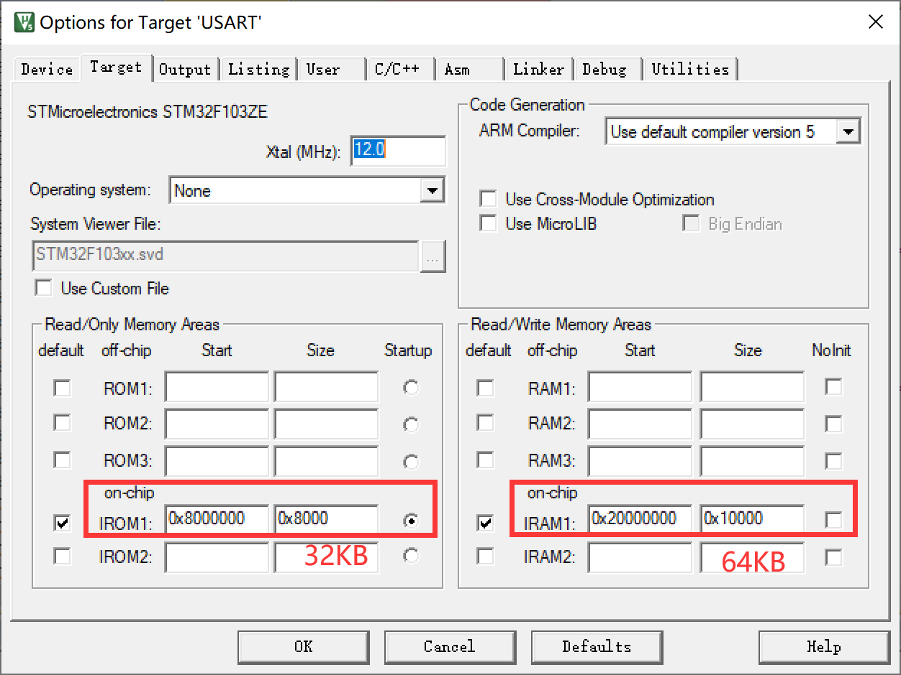

# Bootloader_v1.0

## 使用场景

我们常用的项目开发流程中很少会使用到BootLoader，但是在需要持续更新迭代的项目中，使用BootLoader能够极大地提高用户的使用体验。  
比如我曾经购买的示波器OSC509，PCB上有烧录通孔，但是对于普通用户而言，想要更新程序就要找烧录排针，还是十分麻烦的。所以这台示波器采用sd卡更新程序，只要在sd卡中放入新版本的程序，在接下来的启动中就会自动将该程序（bin文件）下载到单片机的flash中，同时删除sd卡中的bin文件。   
当时只知道Linux中有uBoot，现在知道stm32也可以通过这样的方式启动。

## 原理
### 启动方式
单片机具有Boot0和Boot1脚，在正点原子或者野火的学习板上我们可以通过跳线帽选择启动方式：

*三种启动方式*  
1、第一种方式(boot0 = 0)：Flash memory启动方式
启动地址：0x08000000 是STM32内置的Flash，一般我们使用JTAG或者SWD模式下载程序时，就是下载到这个里面，重启后也直接从这启动程序。基本上都是采用这种模式。

2、第二种方式(boot0 = 1；boot1 = 0)：System memory启动方式
启动地址：0x1FFF0000从系统存储器启动，这种模式启动的程序功能是由厂家设置的。一般来说，这种启动方式用的比较少。系统存储器是芯片内部一块特定的区域，STM32在出厂时，由ST在这个区域内部预置了一段BootLoader， 也就是我们常说的ISP程序， 这是一块ROM，出厂后无法修改。一般来说，我们选用这种启动模式时，是为了从串口下载程序，因为在厂家提供的BootLoader 中，提供了串口下载程序的固件，可以通过这个BootLoader将程序下载到系统的Flash中。但是这个下载方式需要以下步骤：
- 将BOOT0设置为1，BOOT1设置为0，然后按下复位键，这样才能从系统存储器启动BootLoader。 
- 最后在BootLoader的帮助下，通过串口下载程序到Flash中
- 程序下载完成后，又有需要将BOOT0设置为GND，手动复位，按照第1种启动方式的流程启动。  

3、第三种方式(boot0 = 1;boot1 = 1)：SRAM启动方式。
启动地址：0x20000000 内置SRAM，既然是SRAM，自然也就没有程序存储的能力了，这个模式一般用于程序调试。假如我只修改了代码中一个小小的 地方，然后就需要重新擦除整个Flash，比较的费时，可以考虑从这个模式启动代码（也就是STM32的内存中），用于快速的程序调试，等程序调试完成后，在将程序下载到SRAM中。

### 从flash启动
无论如何单片机都是从0x0000_0000的位置开始运行的，其中最重要的就是**PC**和**SP**，PC指的是当前运行的位置，SP指向当前使用RAM的堆栈栈顶。  
我们知道在keil中的魔法棒工具栏中可以选择ROM（即flash）和RAM的起始地址和大小，

*ROM和RAM的地址选择*
当单片机刚上电的时候，会根据Boot0和Boot1的状态选择启动方式，比如选择启动方式1（从flash启动），就会将图中0x0800_0000处的flash内容复制到0x0000_0000处开始运行。  
下面的表格是刚上电时单片机ROM中的状态，此时已将flash内容映射到0x0000_0000：  
| 指针	| 地址 | 功能 |
|:------:|:-------:|:------:|
|  | 0x0000_0000 | 函数__initial_sp |
| PC-->| 0x0000_0004 | 函数Reset Handler |
| 	| 0x0000_0008 | 函数NMI_Handler |
| ... | ... | ... |

```
启动流程：
（1）初始化堆栈指针SP=_initial_sp。
（2）初始化PC指针，令其=Reset_Handler。
（3）初始化中断向量表。
（4）配置系统时钟。
（5）调用C库函数_main初始化用户堆栈，从而最终调用main函数。
```
```C
; Reset handler
Reset_Handler   PROC
                EXPORT  Reset_Handler             [WEAK]
                IMPORT  __main
                IMPORT  SystemInit
                LDR     R0, =SystemInit
                BLX     R0               
                LDR     R0, =__main
                BX      R0
                ENDP
```
已知以上内容，那么我们如何更改程序每次启动所使用的应用程序呢？
我们在单片机中的flash中烧录两个程序，而程序的关键就在于ROM和RAM，ROM保存的是程序（函数的集合）和一些确定的（静态）变量，RAM保存一些动态的变量，那么我们就能描述出一个程序是怎么样的了。  
所以，IAP的关键在于两个程序中的切换，在单片机启动的时候根据BootLoader的内容设置BootLoader程序的SP -> BL堆栈栈顶，  PC -> BL的reset_handler，一直运行下去，直到切换到应用程序。 
上述BL的SP和PC设置是单片机在启动文件startup_stm32f103xe.s中设置的，但由于BL和App程序很难做到在flash中完全连接在一起，这俩程序是独立的，也就是分开来进行烧录的，互不影响，所以切换到App的时候需要我们手动设置PC和SP的指向，接着完全交由单片机运行。
## 代码示例
语言：C  
编译器：Keil5  
stm32库：HAL-1.5.x  
串口：UART1

```C
//BootLoader程序
/************************************************
				BootLoader V1.0
************************************************/

//定义App放置的位置
#define App_Address	0x08008000

//定义函数指针
typedef void (* pFunc)(void);

//汇编函数，调用MSR存储主堆栈指针的值（重要），App的首地址0x08008000位置存储的是RAM中的堆栈栈顶指针（即地址），将其赋值给MSP（主堆栈指针），使其指向堆栈
//根据编译器版本不同选择版本
//会有报错但并可以编译
__asm void MSR_MSP(u32 addr) 
{
    MSR MSP, r0 			//set Main Stack value
    BX r14
}

//这个在编译器中运行不了
//void MSR_MSP(uint32_t addr) 
//{
//    __ASM("MSR MSP, r0"); 
//    __ASM("BX r14");
//}

void IAP_Jump2App(uint32_t app_addr)
{
	pFunc Jump2App = NULL;
	//这是一个关键的检查，可以在魔术棒菜单中看到RAM的地址范围是0x20000000--0x20010000，所以我们的app程序的堆栈栈顶地址必须在这个范围之内
	if(((*(uint32_t *)(app_addr)) & 0x2FFE0000) == 0x20000000)
	{
		//App的地址向后移动4个字节存储的就是Reset_Handler函数（程序开始）的地址，所以对App+4这个位置解引用就可以获得函数地址
		Jump2App = *(pFunc *)(app_addr + 4);
		//设置当前MSP指向App的堆栈栈顶
		MSR_MSP(app_addr);
		//跳转到App程序的开始
		Jump2App();
	}
}	

void sys_Init(void)
{
	
}

void sys_Deinit(void)
{

}

//BL在Flash中的起始地址为0x08000000，分配ROM大小为32K（0x8000）
int main(void)
{
    //初始化系统
	sys_Init();

	printf("\r\n======================================================================");
	printf("\r\n=              (C) COPYRIGHT 2024 www.hawkjgogogo.com                =");
	printf("\r\n=                                                                    =");
	printf("\r\n=         In-Application Programming Application  (Version 1.0)      =");
	printf("\r\n=                                                                    =");
	printf("\r\n=                                             By HawkJ               =");
	printf("\r\n======================================================================");
	printf("\r\n\r\n");

	//关闭已经初始化的外设
	sys_Deinit();

	//进入BLL的Jump2App函数
	//可以在此处设置一些条件，比如按键触发等等
	IAP_Jump2App(App_Address);
	
    while(1);
}
```

```C
//App函数
/************************************************
							IAP_App Test
************************************************/
//设置中断向量表的偏移量，即App的起始地址
#define NVIC_VectTab_FLASH	0x08000000
#define App_Flash_Offset 		0x8000


void sys_Init(void)
{
	
}

void sys_Deinit(void)
{

}

int main(void)
{
	//设置中断向量表，如果是在操作系统中要注意在进入main之前会不会进入&Super&main（在RT-Thread中会出现）
	//最好在设置中断向量表偏移的时候关闭中
	//标准库
	//NVIC_SetVector(NVIC_VectTab_FLASH,App_Flash_Offset);
	//HAL库
	SCB->VTOR = FLASH_BASE | App_Flash_Offset;
	
	sys_Init();
	printf("\r\n======================================================================");
	printf("\r\n=                      已进入App											               =");
	printf("\r\n======================================================================");
	printf("\r\n\r\n");
  	while(1);
}

```